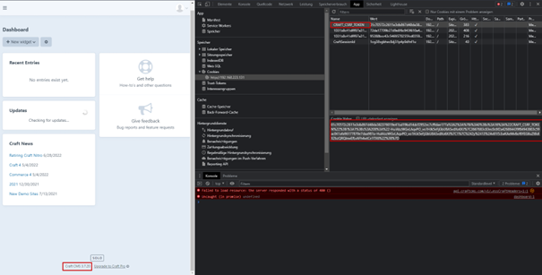
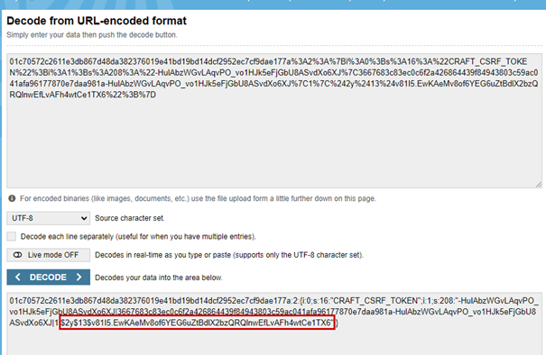
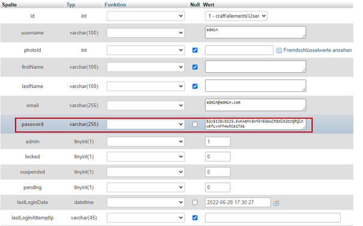

# CVE-2022-37783: Disclosure of password hashes
<b>Affected Product:</b> Craft CMS  
<b>Affected Versions:</b> 3.0.0 – 3.7.32  
<b>Fixed Version:</b> >=3.7.33 
<b>CVE-Number:</b> CVE-2022-37783 
<b>Severity:</b> High 

*Discovered by Ing. Simon Schönegger, BSc (Office Graz), Harald Schmal, BSc (Office Vienna)*

During a penetration test for a customer, researchers of TÜV Trust IT Austria were able to discover that Craft CMS discloses the users’ password hashes in CSRF-Cookies and CSRF-Tokens. The initial disclosure to the vendor was performed by the customer and the vulnerability was fixed in 3.7.33. However, all older versions of Craft CMS are still affected by this vulnerability and no security advisory was published by the vendor. Therefore, TÜV Austria decided to contact the vendor again with the goal of providing a security advisory and performing responsible disclosure. As of 5th of July 2022 the vendor integrated a message in the affected versions of Craft CMS urging the users to update to at least version 3.7.33. The public disclosure of the vulnerability was scheduled for 4th of August 2022.

## Anatomy of the vulnerability
Craft CMS disclosed the password hashes of all users who log into the system using E-Mail or username. Users utilizing SAML-Login are not affected by this vulnerability. The Craft-CSRF Cookie contained the password hash URL-Encoded.

The password is hashed using bcrypt which is a slow hash to crack. The disclosure of the password hash is caused by bad coding practices by mixing the users hashed password into the CSRF-Token.

Since the cookie attribute “HTTP-Only” is set per default the cookie may not be exfiltrated using an XSS attack.

However, the password hash is also included in the Craft-CSRF-Token contained in the HTML of the page. In this case the hash is not URL-Encoded, it is masked by an out of the box function of the YII-Framework.  The masking of the token can be undone by minor changes to the unmasking function publicly available in the YII-Framework. Since the CSRF-Token is present in HTML an attacker can exfiltrate it using a XSS attack.

## Vendor contact timeline 
| Date       | Action                                                                                                                                                                             |
|------------|------------------------------------------------------------------------------------------------------------------------------------------------------------------------------------|
| 2022-01    | Initial contact by the customer                                                                                                                                                    |
| 2022-02    | Fix by the vendor – no security advisory published                                                                                                                                 |
| 2022-06-29 | Initial contact by TÜV Austria through the vendors contact form                                                                                                                    |
| 2022-06-30 | Response from the vendor                                                                                                                                                           |
| 2022-06-30 | TÜV Austria shares a report on this vulnerability and its impact with the vendor                                                                                                   |
| 2022-07-02 | Response from the vendor that this vulnerability has already been fixed and only affects older versions                                                                            |
| 2022-07-03 | TÜV Austria responds that all versions of the past 4 years are affected by this vulnerability and schedules 4th of August for public disclosure                                    |
| 2022-07-06 | Vendor responds that release 3.7.33 is now marked as critical and users are encouraged to update to at least this version. Vendor agrees on a public disclosure on August 4th 2022 |
| 2022-08-04 | Vulnerability is reported to a CNA                                                                                                                                                 |
| 2022-09-13 | CVE-2022-37783 is allocated for this vulnerability by the CNA                                                                                                                      |
